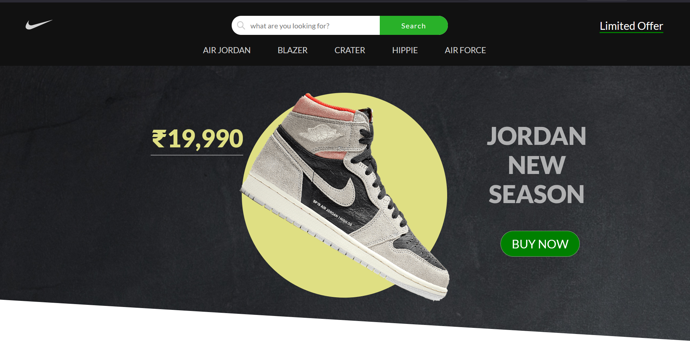

<div align="center">

  <h2 align="center">Responsive Nike Clone</h2>

In this project, I have created Responsive Nike Clone, The project is built using HTML5, CSS3 & JavaScript.

<a href="https://abhay19sharma.github.io/Responsive-nike-clone/"><strong>➥ Live Demo</strong></a>

</div>

### Demo Screeshots



### Prerequisites

Before you begin, ensure you have met the following requirements:

- [Git](https://git-scm.com/downloads "Download Git") must be installed on your operating system.

### Run Locally

To run **responsive-nike-clone** locally, run this command on your git bash:

Linux and macOS:

```bash
sudo git clone https://github.com/Abhay19sharma/Responsive-nike-clone
```

Windows:

```bash
git clone https://github.com/Abhay19sharma/Responsive-nike-clone
```

### Contact

If you have any questions, suggestions, or feedback, you can reach out to the project maintainer:

- Name : [Abhay Sharma](https://www.linkedin.com/in/abhay-sharma-314830283)
- Email: [as.abhaysharma19@gmail.com](mailto:as.abhaysharma19@gmail.com)

---

### License

This project is licensed under the [MIT License](LICENSE). Feel free to use the code for personal or commercial purposes.
